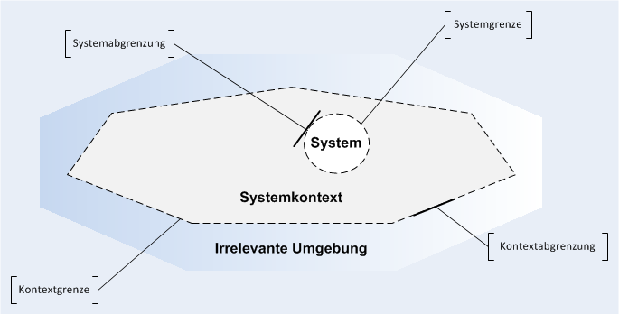
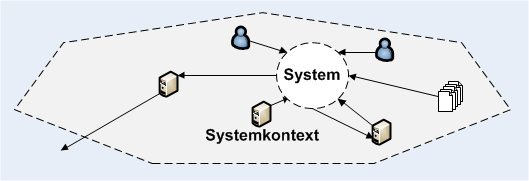

# Vorlesung Kapitel 2: System und Systemkontext abgrenzen (nach IREB)

Quelle: `Unterlagen/Theorie/Requirements Engineering - Blockveranstaltung - v4.pdf`, Folien 23 bis 31.
Festgehalten am 01.10.2026 als Maßstab für unsere Folie „System- und Kontextabgrenzung“.

## Was die Folien sagen

| Folie | Inhalt |
|---|---|
| 23 | Systeme interagieren mit anderen Systemen. Es muss abgegrenzt werden, was zum System und zu seiner Umgebung (Systemkontext) gehört und was nicht. Abgrenzung in der **Soll-Perspektive**, nicht in der Ist-Perspektive. Im Systemkontext können sich befinden: **Personen, Systeme im Betrieb, Prozesse, Ereignisse, Dokumente**. Erste Anforderungen ergeben sich aus diesen Aspekten. |
| 24 | Definition **Systemkontext**: der Teil der Umgebung eines Systems, der für die Definition und das Verständnis der Anforderungen relevant ist. Abbildung: System, Systemkontext, irrelevante Umgebung. |
| 25 | Die **Systemabgrenzung** legt fest, welche Aspekte zum System gehören und welche zum Systemkontext. Die **Kontextabgrenzung** bestimmt, welche Aspekte eine Beziehung zum geplanten System haben. |
| 26 | Definition **Systemgrenze**: trennt das geplante System von seiner Umgebung, also den gestaltbaren und veränderbaren Teil der Realität von dem, was durch die Entwicklung nicht verändert wird. Abbildung: System mit Personen, Systemen und Dokumenten als Quellen und Senken. |
| 27 | Ausgangspunkt der Abgrenzung sind **Schnittstellen**: **Quellen (Input)** und **Senken (Output)**. Mögliche Quellen und Senken: Stakeholder, bestehende Systeme. Die exakte Systemgrenze steht teilweise erst später fest, bis dahin gibt es eine **Grauzone**. |
| 28 | Definition **Kontextgrenze**: trennt den relevanten Teil der Umgebung vom irrelevanten Teil, der keinen Einfluss auf das System und seine Anforderungen hat. |
| 29 | Auch die Kontextgrenze wird nach und nach konkretisiert. Eine vollständige Kontextabgrenzung ist praktisch nicht möglich. **Grauzone der Kontextabgrenzung**: Aspekte, bei denen unklar ist, ob sie eine Beziehung zum System haben. |
| 30 | Dokumentation des Systemkontexts: **Use-Case-Diagramme oder Datenflussdiagramme**, gegebenenfalls mehrere Formen kombinieren. |
| 31 | Zusammenfassung der Punkte oben. |

## Die zwei Abbildungen

Folie 24 und 28: drei Bereiche von innen nach außen. **System** als Kreis mit gestrichelter Systemgrenze, darum der **Systemkontext** mit gestrichelter Kontextgrenze, außen die **irrelevante Umgebung**. Beschriftet sind Systemgrenze, Systemabgrenzung, Kontextgrenze und Kontextabgrenzung.

Folie 26: System im Systemkontext, verbunden durch Pfeile mit Personen, anderen Systemen und Dokumenten. Pfeile zum System sind Quellen, Pfeile vom System weg sind Senken. Ein Nachbarsystem hat zusätzlich eine Verbindung nach außen über die Kontextgrenze hinaus.

## Checkliste für unsere Folie

1. Soll-Perspektive, nicht Ist.
2. Drei Bereiche sichtbar: System, Systemkontext, irrelevante Umgebung.
3. Systemgrenze und Kontextgrenze eingezeichnet und benannt, beide gestrichelt wie in der Vorlesung.
4. Alle fünf Aspektarten geprüft: Personen, Systeme im Betrieb, Prozesse, Ereignisse, Dokumente.
5. Schnittstellen als Quellen (Input) und Senken (Output) mit Pfeilrichtung.
6. Grauzone benannt: was ist noch unklar, an der Systemgrenze und an der Kontextgrenze.
7. Mindestens ein Beispiel für die irrelevante Umgebung, damit die Kontextgrenze begründet ist.
8. Darstellung als Datenfluss- oder Use-Case-Diagramm.
